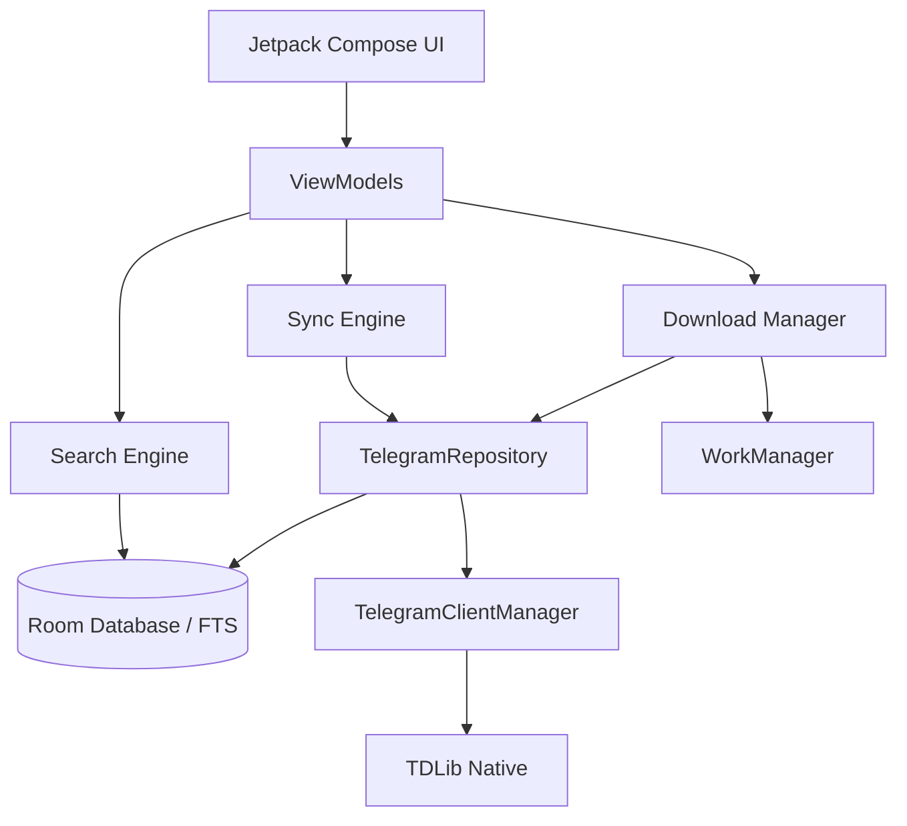
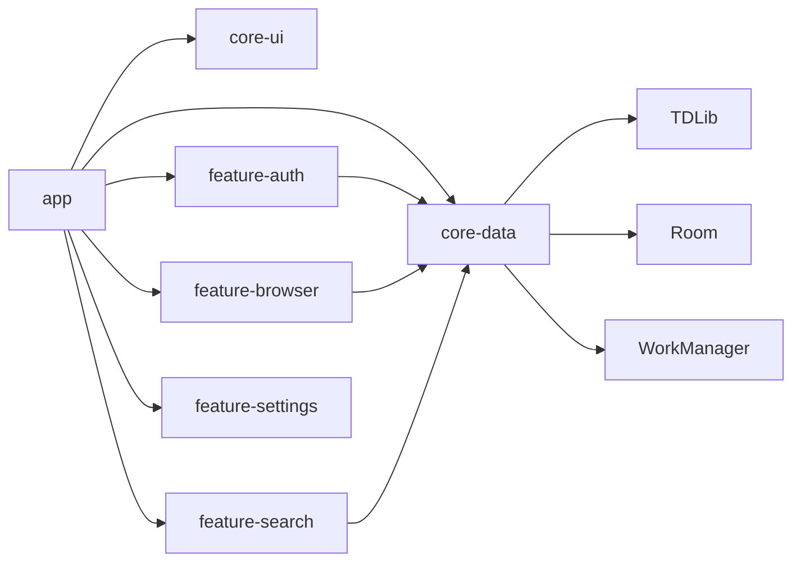
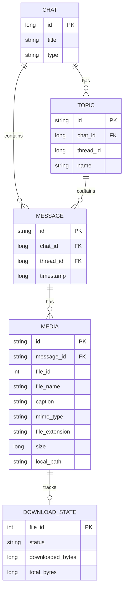
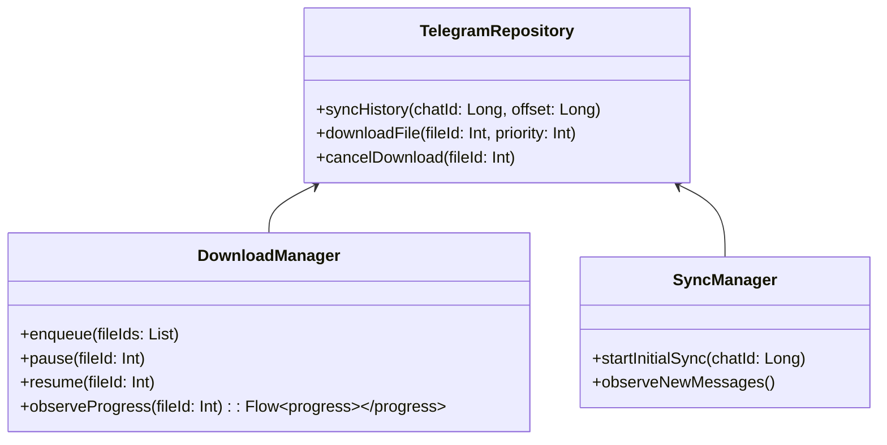
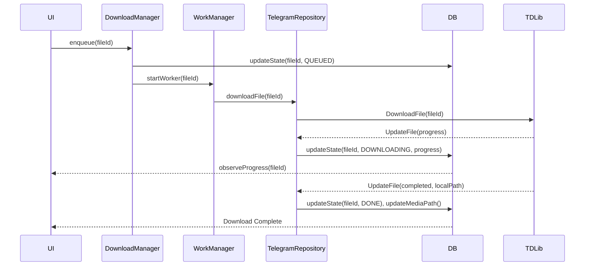

# Telegram Archive: Migration & Architecture Plan

This document outlines the engineering strategy to transform the existing PixelPlay music player into the generic "Telegram Archive" application.

---

## 1. Full Migration Strategy

**Classification:** Incremental architectural pivot.
**Approach:** We will migrate the application in strictly defined, non-breaking milestones.
1. **Data Layer Overhaul:** Transition the Room database from audio-specific schemas (`TelegramSongEntity`) to generic archival schemas (`MessageEntity`, `MediaEntity`).
2. **TDLib Abstraction Refactoring:** Modify `TelegramRepository` to remove audio-only filters and support all file types. Fix the OOM-vulnerable in-memory list aggregations.
3. **Download Engine Implementation:** Introduce a WorkManager-backed robust download queue, replacing the simplistic in-memory `async` coroutines.
4. **Sync & Indexing:** Implement the background synchronization engine and FTS (Full-Text Search) tables.
5. **UI Pivot:** Strip out ExoPlayer, Player Sheets, and Audio-specific UI, replacing them with a File/Folder hierarchy browser.
6. **Export & Settings:** Implement metadata export functionality and user-configurable limits.

---

## 2. Refactoring Roadmap (Milestones)

*   **Milestone 1: Generic Data Foundation**
    *   *Purpose:* Establish the new Room schema.
    *   *Changes:* Create `ArchiveDatabase`, `ArchiveDao`, and all new entities.
*   **Milestone 2: TDLib Generalization**
    *   *Purpose:* Allow TDLib to fetch and process ANY message type.
    *   *Changes:* Rewrite `TelegramRepository` fetch methods; remove `SearchMessagesFilterAudio`. Update mappers to generate `ArchiveItem`.
*   **Milestone 3: The Download Engine**
    *   *Purpose:* Background-resilient downloading with pause/resume.
    *   *Changes:* Create `DownloadWorker`, `DownloadManager`, and track states in Room.
*   **Milestone 4: Synchronization & Indexing Engine**
    *   *Purpose:* Keep local DB in sync with Telegram without redownloading.
    *   *Changes:* Implement `SyncManager` using `UpdateNewMessage` and paginated history fetching. Build FTS4 indices.
*   **Milestone 5: UI Transformation**
    *   *Purpose:* Replace music player UI with Archive Browser.
    *   *Changes:* Delete player UI components. Build Chat -> Topic -> Media navigation flow.
*   **Milestone 6: Settings & Export**
    *   *Purpose:* Add JSON/SQLite export and user settings.
    *   *Changes:* `ExportService`, Settings UI, DataStore preferences.

---

## 3. Architecture Diagrams



---

## 4. Dependency Diagrams



---

## 5. Package Structure

```text
com.telegramarchive.app
├── core
│   ├── di             (Dependency Injection)
│   ├── network        (TDLib wrappers, ClientManager)
│   ├── database       (Room DAOs, Entities, FTS)
│   ├── download       (DownloadManager, WorkManager workers)
│   └── sync           (SyncManager, State tracking)
├── domain
│   ├── models         (ArchiveItem, Chat, Topic)
│   └── usecases       (SearchFiles, ExportMetadata)
└── presentation
    ├── auth           (Login flow - reused)
    ├── browser        (Chat/Topic/File browsing)
    ├── search         (Search UI)
    └── settings       (Config & Export UI)
```

---

## 6. Database Schema


*Note: A Virtual Table (FTS4) will mirror `MEDIA` for full-text search on `file_name`, `caption`, and `file_extension`.*

---

## 7. Class Diagrams (Domain/Data)



---

## 8. Sequence Diagrams

**Download Flow:**


---

## 9. Download Engine Design

**Component:** `DownloadWorker` (WorkManager Foreground Service)
- **Queueing:** Users can select 1 to N files. Added to `DOWNLOAD_STATE` DB as `QUEUED`. WorkManager processes sequentially or concurrently based on user settings.
- **Resilience:** If the app is killed, WorkManager restarts the worker. TDLib natively resumes partial downloads.
- **Priority:** TDLib priorities (1-32). We will use 1 for foreground, 16 for background bulk.
- **State Management:** Tracked via TDLib's `UpdateFile`. Pushed to Room -> StateFlow -> UI.

---

## 10. Synchronization Engine Design

**Component:** `SyncManager`
- **Initial Sync:** Uses `SearchChatMessages` (filter = null) to walk backward using `fromMessageId`. Batched in chunks of 100.
- **State Tracking:** Saves `last_synced_message_id` per chat/topic in a `SYNC_STATUS` table.
- **Incremental:** On startup, fetches messages newer than `last_synced_message_id`.
- **Live Sync:** Subscribes to `TelegramClientManager.updates` for `UpdateNewMessage` to instantly index incoming files.

---

## 11. Search / Indexing Engine Design

**Component:** Room FTS4/FTS5
- Creating a `MediaFts` virtual table mapping to `MediaEntity`.
- **Indexed columns:** `caption`, `file_name`, `file_extension`, `mime_type`.
- **Query execution:** `SELECT * FROM MEDIA JOIN MediaFts ON MEDIA.id = MediaFts.docid WHERE MediaFts MATCH :query`
- Searching is 100% offline and instantaneous.

---

## 12. UI Navigation Architecture

- **AuthGraph:** Login -> OTP -> 2FA.
- **MainGraph:**
  - **Dashboard:** List of synced Chats/Channels/Saved Messages.
  - **TopicBrowser:** List of topics for a selected Supergroup.
  - **MediaList:** Paginated list of media. Toggleable views (Grid/List). Filterable by type (Images, Videos, Docs, Audio, Archives).
  - **Search:** Global offline search screen.
  - **Downloads:** Active queue manager.
  - **Settings:** App configuration and export triggers.

---

## 13. Module Breakdown

While currently a monolith, logical boundaries will be enforced:
- `:core:tdlib` (Strictly `TelegramClientManager` and native libs)
- `:core:database` (Room schemas and DAOs)
- `:core:domain` (Use cases and generic models)
- `:feature:*` (UI and ViewModels)

---

## 14. Risk Analysis

| Risk | Impact | Mitigation |
| :--- | :--- | :--- |
| **OOM on bulk sync** | High | Migrate from `allSongs.add()` memory aggregation to streaming DB inserts. |
| **Disk Exhaustion** | High | Unrestricted downloads will fill devices. Add a Settings limit and a "Clear Cache" tool that respects user-pinned files. |
| **TDLib State Corruption** | Medium | TDLib's internal DB can corrupt if force-killed. Provide an "Emergency Reset TDLib" in settings. |
| **WorkManager Throttling** | Medium | OEMs kill background workers. Use Foreground Services with ongoing notifications for active download queues. |

---

## 15. Technical Debt Inherited

- **Aggressive Cleanup:** `TelegramCacheManager` explicitly deletes evicted audio files to save space. *Must be removed immediately.*
- **Hardcoded Media Types:** `TelegramCoilFetcher` and `TelegramRepository` have heavily hardcoded assumptions about Audio & Album Art.
- **Proxy Workarounds:** `TelegramStreamProxy` exists to trick ExoPlayer. We are abandoning streaming for archiving, so this is dead weight.

---

## 16. Components That Should Remain Untouched

*   **Classification:** Reuse Unchanged
    *   `TelegramClientManager.kt`: Perfectly abstracts TDLib lifecycle, JNI, and Flow emissions.
    *   `TelegramLoginViewModel.kt` & `TelegramLoginActivity.kt`: The auth flow is robust, generic, and handles all standard Telegram auth states.
    *   DI Modules (Network/Auth): Setup is standard and reusable.
    *   Architecture/Coroutines: Flow-based MVVM design is solid.

---

## 17. Components That Should Be Rewritten

*   **Classification:** Reuse with Modifications
    *   `TelegramRepository.kt`: The core TDLib request logic is sound, but `SearchMessagesFilterAudio` must be removed. The mapping logic must translate `TdApi.Message` to generic `MediaEntity` rather than `Song`.
    *   `TelegramDao.kt`: Must be completely replaced with `ArchiveDao`, migrating from `TelegramSongEntity` to the new relational schemas.
    *   `TelegramDashboardViewModel.kt`: Sync logic structure is good but needs to point to the new DB entities.

---

## 18. Components That Should Simply Be Removed

*   **Classification:** Delete / Replace Completely
    *   `TelegramStreamProxy.kt`: HTTP server is unnecessary for file archiving.
    *   `TelegramCacheManager.kt`: Current implementation actively destroys the user's files to save space. We want to archive them.
    *   `TelegramCoilFetcher.kt`: Hardcoded to extract audio ID3 tags. Standard image loading using local file paths will replace this.
    *   `PlayerViewModel.kt`, `MediaControllerSyncStateHolder.kt`, `DualPlayerEngine.kt`: The entire music playback suite is obsolete for this product pivot.
