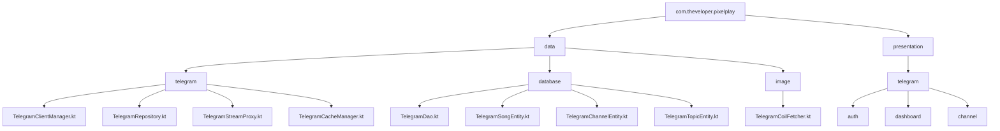
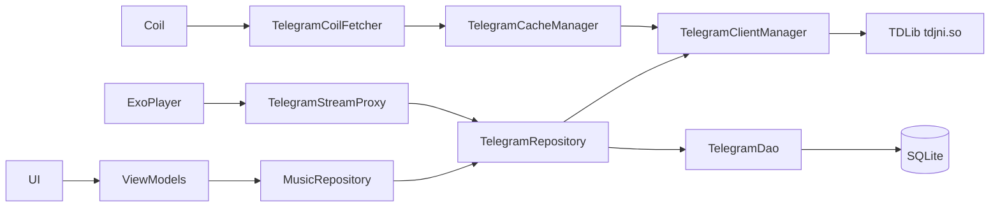
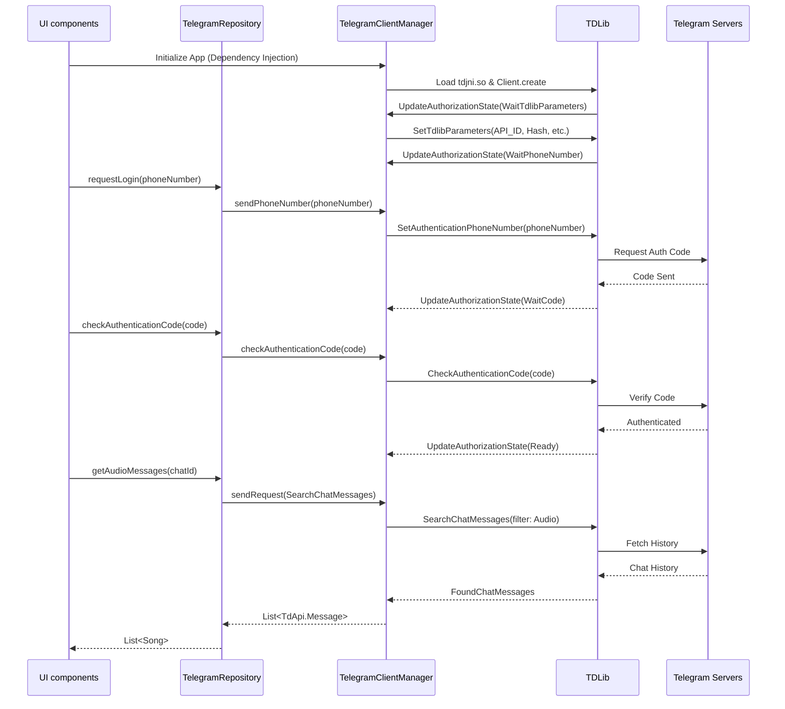
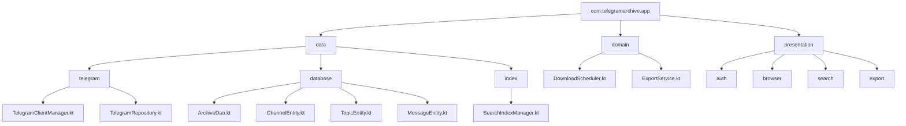
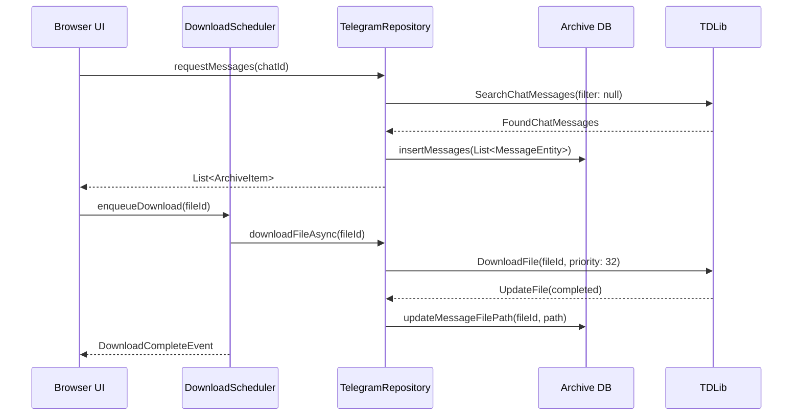
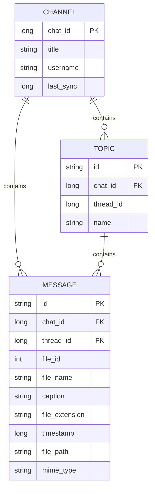
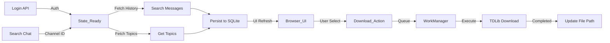
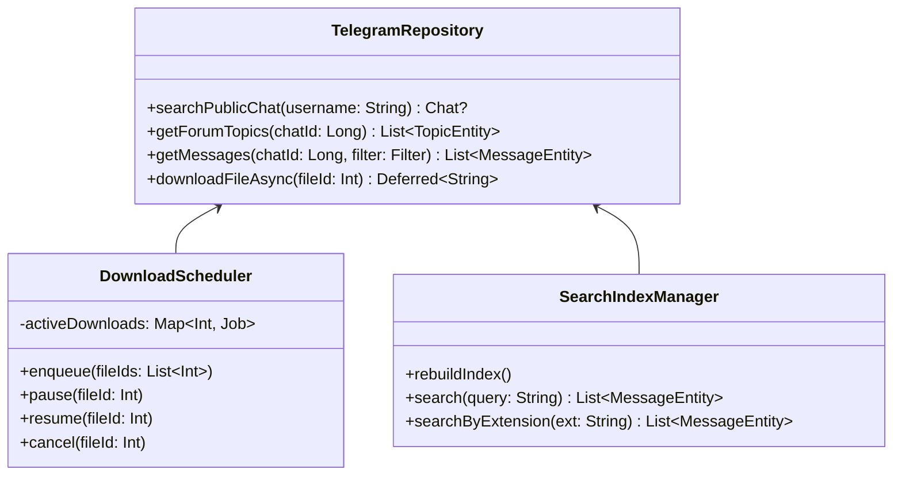

# Telegram Subsystem Reverse Engineering Report

## Part 1 — Complete Telegram Architecture

### Map of Telegram-Related Files

**Core Networking & TDLib Integration**
- `app/src/main/java/com/theveloper/pixelplay/data/telegram/TelegramClientManager.kt`
  - **Why it exists:** Core wrapper for TDLib native JNI bindings.
  - **Created by:** Dependency Injection (`@Singleton` via Hilt).
  - **Dependencies:** `Context`, `tdjni.so`.
  - **Responsibilities:** Load native library, initialize `org.drinkless.tdlib.Client`, manage `AuthorizationState`, route updates and errors into Coroutine Flows, provide `sendRequest` bridge.
  - **Interfaces exposed:** `authorizationState`, `updates`, `errors` flows, `sendPhoneNumber`, `checkAuthenticationCode`, `checkAuthenticationPassword`, `logout`, `sendRequest`.
  - **Called by:** `TelegramRepository`, `TelegramCacheManager`.

- `app/src/main/java/com/theveloper/pixelplay/data/telegram/TelegramRepository.kt`
  - **Why it exists:** High-level abstraction for Telegram logic (fetching messages, channels, downloading files).
  - **Created by:** Dependency Injection (`@Singleton`).
  - **Dependencies:** `TelegramClientManager`, `TelegramDao`, `PlaylistPreferencesRepository`.
  - **Responsibilities:** Fetch chat history, handle forum topics, manage download queues, map `TdApi.Message` to `Song` domain objects.
  - **Interfaces exposed:** `searchPublicChat`, `getAudioMessages`, `getForumTopics`, `getAudioMessagesByTopic`, `downloadFileAwait`, `isForum`.
  - **Called by:** ViewModels (`TelegramDashboardViewModel`, `TelegramChannelSearchViewModel`, `TelegramLoginViewModel`), `TelegramStreamProxy`, `TelegramCoilFetcher`.

- `app/src/main/java/com/theveloper/pixelplay/data/telegram/TelegramStreamProxy.kt`
  - **Why it exists:** A local HTTP server bridging TDLib's downloaded files to ExoPlayer.
  - **Created by:** Dependency Injection (`@Singleton`).
  - **Dependencies:** `TelegramRepository`.
  - **Responsibilities:** Run a Ktor CIO server, handle `Range` requests, stream audio bytes as TDLib downloads them.
  - **Interfaces exposed:** `start()`, `stop()`, `getProxyUrl()`.
  - **Called by:** Player engine (inferred from ExoPlayer proxy usage).

- `app/src/main/java/com/theveloper/pixelplay/data/telegram/TelegramCacheManager.kt`
  - **Why it exists:** Prevents unbounded disk usage by TDLib and embedded artwork.
  - **Created by:** Dependency Injection (`@Singleton`).
  - **Dependencies:** `Context`, `TelegramClientManager`.
  - **Responsibilities:** LRU caching for played audio files, extraction of embedded art via `MediaMetadataRetriever`, garbage collection via `TdApi.OptimizeStorage`.
  - **Interfaces exposed:** `setActivePlayback`, `onPlaybackStopped`, `trimEmbeddedArtCache`, `clearTdLibCache`.
  - **Called by:** `PlayerViewModel` / `PlayerEngine` (inferred), `TelegramCoilFetcher`.

**Data Layer**
- `app/src/main/java/com/theveloper/pixelplay/data/database/TelegramDao.kt`
  - **Why it exists:** Room DAO for persisting discovered Telegram content.
- `app/src/main/java/com/theveloper/pixelplay/data/database/TelegramSongEntity.kt`
  - **Why it exists:** Schema mapping for `Song` metadata synced from Telegram.
- `app/src/main/java/com/theveloper/pixelplay/data/database/TelegramChannelEntity.kt`
  - **Why it exists:** Schema mapping for synced Channels.
- `app/src/main/java/com/theveloper/pixelplay/data/database/TelegramTopicEntity.kt`
  - **Why it exists:** Schema mapping for Forum topics inside Supergroups.

**Presentation Layer**
- `app/src/main/java/com/theveloper/pixelplay/presentation/telegram/auth/TelegramLoginViewModel.kt`
- `app/src/main/java/com/theveloper/pixelplay/presentation/telegram/auth/TelegramLoginActivity.kt`
- `app/src/main/java/com/theveloper/pixelplay/presentation/telegram/dashboard/TelegramDashboardViewModel.kt`
- `app/src/main/java/com/theveloper/pixelplay/presentation/telegram/dashboard/TelegramDashboardScreen.kt`
- `app/src/main/java/com/theveloper/pixelplay/presentation/telegram/channel/TelegramChannelSearchViewModel.kt`

**Image Loading**
- `app/src/main/java/com/theveloper/pixelplay/data/image/TelegramCoilFetcher.kt`
  - **Why it exists:** Custom Coil fetcher for `telegram_art://` URIs.

### Architecture Diagrams

**Package Hierarchy**



**Dependency Graph (Inferred & Confirmed)**



**Lifecycle Sequence Diagram**



---

## Part 2 — TDLib Deep Dive

✅ **Confirmed from source code:** `app/src/main/java/com/theveloper/pixelplay/data/telegram/TelegramClientManager.kt` manages TDLib.

**Initialization**
- `System.loadLibrary("tdjni")` is called in the `companion object` (Lines ~25-29).
- `Client.create(updateHandler, null, null)` spins up the native client (Line ~76).
- Log verbosity is forced to `1` (Errors only) via `Client.execute(TdApi.SetLogVerbosityLevel(1))` (Line ~71).

**Lifecycle & Authorization State Machine**
TDLib pushes state updates to `updateHandler` (Lines ~46-64):
1. `TdApi.UpdateAuthorizationState` received.
2. If `AuthorizationStateWaitTdlibParameters`: Calls `TdApi.SetTdlibParameters` using `BuildConfig.TELEGRAM_API_ID` and `TELEGRAM_API_HASH`. Files are stored in `filesDir/tdlib` and `filesDir/tdlib_files` (Lines ~82-108).
3. If `AuthorizationStateWaitPhoneNumber`: UI intercepts via `authorizationState` flow.
4. If `AuthorizationStateWaitCode`: UI intercepts.
5. If `AuthorizationStateReady`: Authentication complete.

**Coroutine Wrapping & Thread Model**
✅ **Confirmed:** Native callbacks are bridged to coroutines using `suspendCancellableCoroutine` (Lines ~144-162):
```kotlin
suspend fun <T : TdApi.Object> sendRequest(function: TdApi.Function<*>): T = kotlinx.coroutines.suspendCancellableCoroutine { continuation -> ... }
```
- A shared flow `_updates` (capacity 64) handles `TdApi.UpdateFile` and other push events (Line ~37).
- Error events are pushed to `_errors` (capacity 16) (Line ~40).

---

## Part 3 — Authentication

✅ **Confirmed from source code:** `app/src/main/java/com/theveloper/pixelplay/presentation/telegram/auth/TelegramLoginViewModel.kt` and `app/src/main/java/com/theveloper/pixelplay/data/telegram/TelegramClientManager.kt`.

**Trace:**
`TelegramLoginActivity` (UI) -> `TelegramLoginViewModel.sendPhoneNumber()` -> `TelegramRepository.sendPhoneNumberAwait()` -> `TelegramClientManager.sendRequest(SetAuthenticationPhoneNumber)` -> TDLib -> Telegram Servers.

**Supported Methods:**
- ✅ Phone Login (`SetAuthenticationPhoneNumber`)
- ✅ OTP (`CheckAuthenticationCode`)
- ✅ 2FA Password (`CheckAuthenticationPassword`)
- ❓ QR Login / Email Verification (Not implemented in `TelegramLoginViewModel`).

**Session Restoration:**
⚠️ **Inferred:** TDLib automatically restores sessions. Upon initialization, it reads `filesDir/tdlib`. If valid, it immediately transitions to `AuthorizationStateReady` bypassing the phone prompt. Sessions persist indefinitely unless `LogOut` is called.

---

## Part 4 — Channel Discovery

✅ **Confirmed from source code:** `app/src/main/java/com/theveloper/pixelplay/data/telegram/TelegramRepository.kt`.

- **Channels/Chats:** Discovered via `TdApi.SearchPublicChat(username)` (Lines ~97-104).
- **Supergroups/Forums:** Verified using `TdApi.GetChat()` then `TdApi.GetSupergroup()`. If `supergroup.isForum` is true, it's a forum (Lines ~108-123).
- **Topics:** Discovered via `TdApi.GetForumTopics()` (Lines ~130-158).
  - **Pagination:** Uses a `while(true)` loop with `offsetDate`, `offsetMessageId`, `offsetForumTopicId` and `limit = 100` (Lines ~137-147).
- **Synchronization:** Saved to `TelegramChannelEntity` and `TelegramTopicEntity` in SQLite via `TelegramDashboardViewModel.syncForumChannel()`.

---

## Part 5 — Message Retrieval

✅ **Confirmed from source code:** `app/src/main/java/com/theveloper/pixelplay/data/telegram/TelegramRepository.kt`.

- **Pipeline:** `getAudioMessages(chatId)` (Lines ~253-294) or `getAudioMessagesByTopic(chatId, threadId)` (Lines ~172-248).
- **Request:** `TdApi.SearchChatMessages` (Line ~268).
- **Filtering:** `TdApi.SearchMessagesFilterAudio()` restricts to audio files (Line ~274).
- **Pagination:** Limits to `batchSize = 100`. Uses `fromMessageId` to paginate backwards until `response.nextFromMessageId == 0L` (Line ~289).
- **Topic Support:** Dynamically sets `topicId` (newer TDLib via reflection) or `messageThreadId` (older TDLib) on the request (Lines ~202-230).
- **Mapping:** `TdApi.MessageAudio` and `TdApi.MessageDocument` (checked for audio mime types / extensions) are mapped to `Song` objects in `mapMessageToSong(message)` (Lines ~296-372).

---

## Part 6 — Media Pipeline

**Audio / Music**
- **Server -> TDLib:** `TdApi.DownloadFile` requested in `TelegramRepository.downloadFileAwait` (Line ~432).
- **Cache:** `TelegramCacheManager` tracks LRU history limit of 5 files. Older files are deleted via `TdApi.DeleteFile` (Lines ~82-108).
- **Disk:** TDLib saves to `filesDir/tdlib_files`.
- **Database:** `persistSongFilePathIfNeeded` updates `TelegramSongEntity.filePath` (Lines ~388-395).
- **UI:** ExoPlayer reads via `TelegramStreamProxy`.

**Photos / Thumbnails**
- **Extraction:** `app/src/main/java/com/theveloper/pixelplay/data/image/TelegramCoilFetcher.kt` handles `telegram_art://` URIs.
- **Priority:** `albumCoverThumbnail` > `externalAlbumCovers` > `document.thumbnail` (Lines ~154-167).
- **Embedded Art:** Extracted via `MediaMetadataRetriever` in `TelegramCoilFetcher.extractAndCacheEmbeddedArt` (Lines ~113-148). Cached in `cacheDir` as `telegram_embedded_art_*.jpg`.

**Other Media**
❓ **Unknown/Unsupported:** Videos, Animations, Stickers, Voice Notes are filtered out by `SearchMessagesFilterAudio` and mime-type checks.

---

## Part 7 — Download Manager

✅ **Confirmed from source code:** `app/src/main/java/com/theveloper/pixelplay/data/telegram/TelegramRepository.kt` -> `downloadFileAwait` (Lines ~397-482).

- **Priority:** Standard priority is `1` to avoid starving streaming.
- **Concurrency:** Guarded by `activeDownloads` ConcurrentHashMap and a `downloadSemaphore` (likely to limit parallel downloads). Uses `async` with `CoroutineStart.LAZY`.
- **Small Files:** `< 1MB` use synchronous download flag (`synchronous = true`) (Line ~419).
- **Large Files:** Asynchronous `DownloadFile` (Line ~442). Subscribes to `clientManager.updates.filterIsInstance<TdApi.UpdateFile>()` using `withTimeoutOrNull(60_000L)` (Lines ~447-460).
- **Resume Support:** Handled transparently by TDLib.
- **Cancellation:** Coroutine cancellation propogates to the `async` job (Line ~478).

---

## Part 8 — Database

✅ **Confirmed from source code:** `app/src/main/java/com/theveloper/pixelplay/data/database/TelegramDao.kt`, `TelegramSongEntity.kt`, etc.

**Schema:**
- `telegram_channels`: `chat_id` (PK), `title`, `username`, `song_count`, `last_sync_time`, `photo_path`.
- `telegram_topics`: `id` (PK: chatId_threadId), `chat_id`, `thread_id`, `name`, `song_count`.
- `telegram_songs`: `id` (PK: chatId_messageId), `chat_id`, `message_id`, `file_id`, `title`, `file_path`, `thread_id`, etc.

**Synchronization & Duplication:** Uses `OnConflictStrategy.REPLACE` on `id` in `TelegramDao.kt`.
**Indexing:** `chat_id`, `message_id`, `file_id`, `thread_id` are indexed for fast JOINs in `TelegramSongEntity.kt` (Lines ~10-15).

---

## Part 9 — Local Proxy

✅ **Confirmed from source code:** `app/src/main/java/com/theveloper/pixelplay/data/telegram/TelegramStreamProxy.kt`.

**Why it exists:** ExoPlayer requires a standard HTTP stream or URI. TDLib files download progressively and the file path might change or grow. A proxy abstracts TDLib's chunked downloading into a standard HTTP 206 Partial Content stream.

**Implementation:**
- **Engine:** Ktor CIO embedded server running on `127.0.0.1` with dynamic port (Lines ~250-256).
- **Routing:** `/stream/{fileId}` (Line ~28).
- **Range Support:** Parses `Range` headers, returns `206 Partial Content` with `Content-Range` (Lines ~90-136).
- **Streaming:** Uses `RandomAccessFile` (Line ~142).
- **Backpressure / Blocking:** If `currentPos >= cachedDownloadedPrefixSize`, the proxy yields using exponential backoff delay (`delay(stallDelayMs)` up to 400ms) while waiting for `UpdateFile` to report more bytes downloaded (Lines ~164-188).
- **Why not TDLib directly?** ExoPlayer does not have a native TDLib `DataSource`. Implementing an ExoPlayer `DataSource` is tightly coupled. An HTTP proxy allows ANY media player (or even Cast devices) to play the file.

---

## Part 10 — Security Review

- **API Keys:** Read from `BuildConfig.TELEGRAM_API_ID` (`TelegramClientManager.kt`, Line ~92). ⚠️ Can be extracted via reverse engineering the APK.
- **Session Storage:** Unencrypted on disk in `filesDir/tdlib`. Anyone with root access can steal the session folder and impersonate the user.
- **Proxy Security:** Binds to `127.0.0.1`. Generates URLs dynamically. `CloudStreamSecurity.validateTelegramFileId` is used (`TelegramStreamProxy.kt`, Line ~30). ⚠️ Local apps on the same device could potentially port-scan and request file IDs if they guess them.
- **Improvements:**
  - Provide a `databaseEncryptionKey` to `TdApi.SetTdlibParameters` to encrypt the local TDLib database.
  - Implement dynamic tokens on proxy URLs (e.g., `/stream/{fileId}?token=XYZ`).

---

## Part 11 — Performance Review

- **Threading:** Heavy use of `Dispatchers.IO` in Ktor and Room.
- **Flows:** Uses `SharedFlow` with `extraBufferCapacity` to prevent TDLib updates from blocking the native thread.
- **Memory:** `TelegramCacheManager` explicitly trims embedded art to 50MB and audio files to a rolling window of 5 items.
- **Backpressure:** The Ktor proxy streaming loop correctly yields coroutines (`delay`) rather than blocking threads while waiting for network I/O.
- **Potential Bottleneck:** Parsing huge forums (thousands of messages) loads everything into memory in `getAudioMessages`. Pagination is batched by 100, but appended to `allSongs: MutableList`. A channel with 100k songs could OOM.

---

## Part 12 — Converting This Into A Telegram Archive App

To build a generic Telegram Archive App, the architecture needs pivoting from "Music Player" to "File Manager".

**Reusable Classes (Score 9-10):**
- `TelegramClientManager.kt` (Perfect abstraction)
- `TelegramLoginViewModel.kt` & UI (Standard login flow)

**Needs Rewrite (Score 4-6):**
- `TelegramRepository.kt`: Remove `SearchMessagesFilterAudio`. Allow dynamic filters (documents, video, photos).
- `TelegramDao.kt`: Expand schema to include message types, captions, timestamps, file extensions.

**Unnecessary Classes:**
- `TelegramStreamProxy.kt`: If not streaming media, standard file saving is sufficient.
- `TelegramCacheManager.kt`: Remove LRU limits for audio; archiving implies permanent storage.
- `TelegramCoilFetcher.kt`: Replaced with standard Coil/Glide using standard file paths once downloaded.

**New Architecture:**
- UI: Folder hierarchy view (Channels -> Topics -> Files).
- Downloader: A dedicated Foreground Service (WorkManager) for bulk downloading.
- Indexing: FTS4/FTS5 SQLite tables for searching captions and filenames.

### New Architecture Diagrams

**Package Diagram**



**Sequence Diagram (Archive Mode)**



**Database Schema**



**API Flow Diagram**



**Class Diagram (New Domain)**



---

## Part 13 — Optional Archive Features

**Mirror Channel to Local Storage**
- *Complexity:* Moderate.
- *TDLib:* Traverse history using `SearchChatMessages` with null filter.
- *Changes:* Need a robust download queue that survives app restarts.

**Incremental Sync / Detect New Files**
- *Complexity:* Easy.
- *TDLib:* Listen to `UpdateNewMessage` in `TelegramClientManager` update flow.

**Export to JSON / HTML**
- *Complexity:* Easy.
- *Changes:* Iterate Room database entities and serialize to file.

**Resume Interrupted Downloads**
- *Complexity:* Trivial.
- *TDLib:* TDLib handles this natively out of the box when `DownloadFile` is called again.

---

## Part 14 — Repository Audit

| File | Purpose | Reusability (1-10) | Keep in Archive App? |
|---|---|---|---|
| `TelegramClientManager.kt` | TDLib JNI wrapper and flow publisher. | 10 | Yes |
| `TelegramRepository.kt` | Business logic for syncing and fetching. | 6 | Refactor (Remove Audio restriction) |
| `TelegramStreamProxy.kt` | Local HTTP bridge for ExoPlayer. | 2 | No (Unless streaming videos) |
| `TelegramCacheManager.kt` | LRU and embedded art cleanup. | 3 | No (Archivers don't delete files) |
| `TelegramDao.kt` | SQLite database definitions. | 4 | Refactor (Add file metadata) |
| `TelegramLoginViewModel.kt` | UI Logic for Authentication. | 9 | Yes |
| `TelegramDashboardViewModel.kt`| Sync logic for channels/topics. | 5 | Refactor |
| `TelegramCoilFetcher.kt` | Embedded audio art extractor. | 1 | No |
